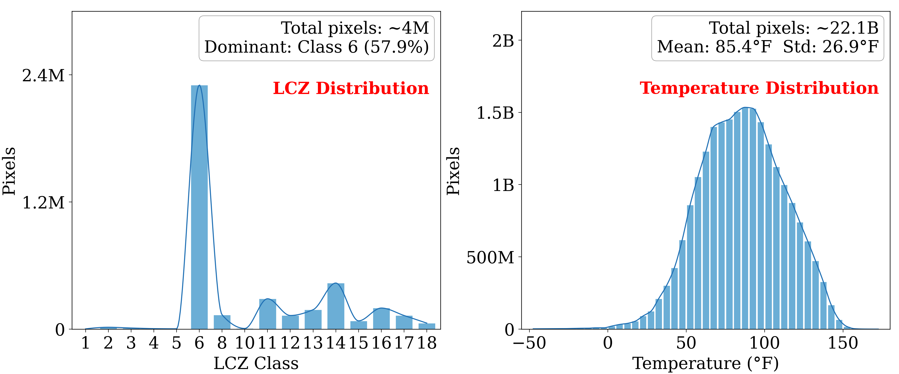
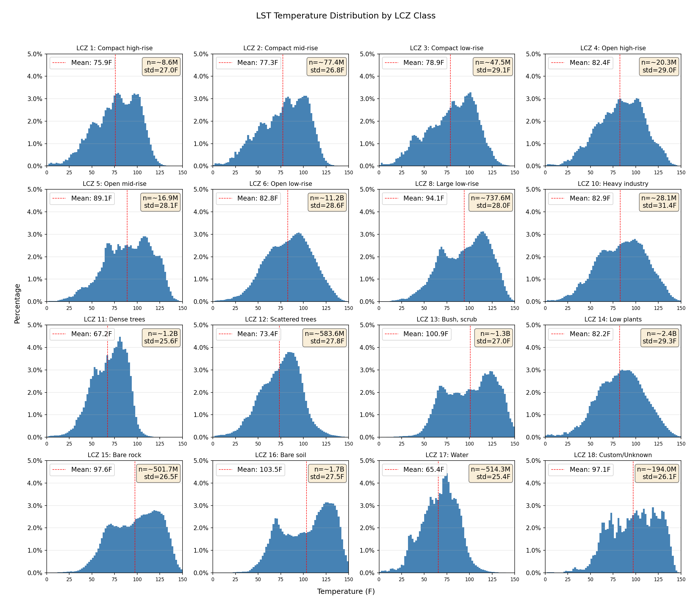

# US-UrbanLST: A Large-Scale High-Resolution Dataset to Advance Research on Land Surface Temperature

[](https://opensource.org/licenses/MIT)
[](https://huggingface.co/datasets/JesseGuerrero/US-UrbanLST)
[](https://kdd.org/kdd2026/)
[](https://www.python.org/downloads/)
[](https://pytorch.org/)

<p align="center">
  <a href="https://github.com/JesseGuerrero/US-UrbanLST">GitHub</a> &bull;
  <a href="https://huggingface.co/datasets/JesseGuerrero/US-UrbanLST">HuggingFace Dataset</a> &bull;
  <a href="https://jesseguerrero.github.io/US-UrbanLST/web-app/">Visualization</a>
</p>

> **KDD 2026 Datasets & Benchmarks Track Submission**

A large-scale open-source benchmark dataset for predicting monthly Land Surface Temperature (LST) at 30m spatial resolution across 124 U.S. metropolitan areas, with Earthformer and CNN+LSTM baselines and an interactive web application.

---

## Overview

Land Surface Temperature (LST) serves as a critical indicator for quantifying urban heat islands and informing climate-resilient urban planning, particularly for vulnerable communities. However, the lack of open-source, large-scale, spatio-temporal datasets poses significant challenges to research at the national scale across the United States.

This repository presents:
- A **benchmark dataset** spanning 124 U.S. cities from 2013-2025 (~1.4 million 128x128 tiles at 30m resolution)
- **Earthformer and CNN+LSTM baselines** with reproducible training pipelines
- An **interactive web application** for visualizing LST predictions over San Antonio, TX

---

## Key Contributions

1. **Cross-city prediction**: 124 cities spanning diverse climates, enabling models that generalize beyond single-city training
2. **Neighborhood-scale resolution**: 30m spatial resolution, sufficient to distinguish thermal differences between adjacent blocks
3. **Reproducible baselines**: Open code, data, and model weights; Earthformer achieves **13.93°F RMSE**, a **~26% improvement** over CNN+LSTM
4. **LST Web Application**: Integrates LST predictions into mapping software through an LLM interface for planning guidance

---

## Dataset

### Download

The dataset is available on HuggingFace: [JesseGuerrero/US-UrbanLST](https://huggingface.co/datasets/JesseGuerrero/US-UrbanLST)

```bash
huggingface-cli download JesseGuerrero/US-UrbanLST --local-dir ./Data/ML --repo-type dataset
```

### Data Components

| Feature | Description | Resolution |
|---------|-------------|------------|
| **LST** | Land Surface Temperature (°F) | 30m, Monthly |
| **NDVI** | Normalized Difference Vegetation Index | 30m, Monthly |
| **NDWI** | Normalized Difference Water Index | 30m, Monthly |
| **NDBI** | Normalized Difference Built-up Index | 30m, Monthly |
| **Albedo** | Surface reflectance ratio | 30m, Monthly |
| **RGB** | Red, Green, Blue channels | 30m, Monthly |
| **DEM** | Digital Elevation Model (NASADEM) | 30m, Static |
| **LCZ** | Local Climate Zones (CONUS-wide) | 100m, Annual |

### Dataset Statistics

| Attribute | Value |
|-----------|-------|
| Spatial Resolution | 30 meters |
| Tile Size | 128 x 128 pixels (3.84 km²) |
| Input Channels | 9 (DEM, LST, R, G, B, NDVI, NDWI, NDBI, Albedo) |
| Output Channel | 1 (LST) |
| Input Sequence Length | 12 months |
| Output Sequence Length | 1 month |
| Total Rasters | ~1.4 million tiles |
| Total Training Sequences | ~200,000 |
| Storage Size | ~150 GB |

### Temporal Splits

| Split | Years | Duration |
|-------|-------|----------|
| Training | 2013-2021 | 9 years |
| Validation | 2022-2023 | 2 years |
| Testing | 2024-2025 | 2 years |

### Data Distribution


*LCZ class distribution across 124 cities and LST temperature distribution across ~22 billion pixels. Mean temperature: 85.4°F, dominated by LCZ Class 6 (Open low-rise, 57.9%).*


*LST temperature distribution by Local Climate Zone class. Built-up areas (LCZ 8: Large low-rise, 94°F mean) and bare surfaces (LCZ 16: Bare soil, 104°F mean) show the highest temperatures, while water (LCZ 17, 65°F mean) and dense trees (LCZ 11, 67°F mean) are coolest.*

### Build Your Own (STAC Scraper)

Alternatively, collect raw Landsat imagery using the STAC API via Microsoft Planetary Computer with `stac_scrapper.ipynb`. This allows you to customize the geographic extent, extend the temporal range, or modify processing parameters.

```bash
pip install pystac-client planetary-computer odc-stac rioxarray
```

---

## Installation

### Requirements

- Python 3.8+
- PyTorch 2.0+
- CUDA 11.8+ (for GPU training)

### Setup

```bash
git clone https://github.com/JesseGuerrero/US-UrbanLST.git
cd US-UrbanLST

python -m venv venv
source venv/bin/activate  # Linux/Mac
# or: venv\Scripts\activate  # Windows

pip install torch pytorch-lightning rasterio numpy pandas wandb tqdm scikit-learn matplotlib earthformer
```

---

## Quick Start

### 1. Download Dataset

```bash
huggingface-cli download JesseGuerrero/US-UrbanLST --local-dir ./Data/ML --repo-type dataset
```

### 2. Setup Data Cache

```bash
python setup_data.py \
    --dataset_root "./Data/ML" \
    --cluster "all" \
    --input_length 12 \
    --output_length 1 \
    --train_years 2013 2014 2015 2016 2017 2018 2019 2020 2021 \
    --val_years 2022 2023 \
    --test_years 2024 2025
```

### 3. Train Model

```bash
python train_with_cache.py \
    --dataset_root "./Data/ML" \
    --cluster "all" \
    --input_length 12 \
    --output_length 1 \
    --model_size "earthnet" \
    --batch_size 32 \
    --max_epochs 200 \
    --learning_rate 0.0001 \
    --train_years 2013 2014 2015 2016 2017 2018 2019 2020 2021 \
    --val_years 2022 2023 \
    --test_years 2024 2025 \
    --gpus 2
```

---

## Model Architectures

| Model | Description |
|-------|-------------|
| `earthnet` | Earthformer (CuboidTransformer) - recommended |
| `lstm` | CNN+LSTM baseline (DMVSTNet) |
| `tiny` / `small` / `medium` / `large` | Transformer variants at different scales |

### Training with Land Cover Clusters

```bash
# Cluster 1: Dense urban (LCZ 1-3)
python train_with_cache.py --cluster "1" --model_size "earthnet"

# Cluster 2: Suburban (LCZ 4-6)
python train_with_cache.py --cluster "2" --model_size "earthnet"

# All data
python train_with_cache.py --cluster "all" --model_size "earthnet"
```

### Channel Ablation

```bash
# RGB only (remove spectral indices, DEM, and historical LST)
python setup_data.py --remove_channels DEM ndvi ndwi ndbi albedo LST
python train_with_cache.py --remove_channels DEM ndvi ndwi ndbi albedo LST
```

---

## Benchmark Results

### Performance by Land Cover Cluster (Test RMSE °F)

| Land Clusters | LCZ | Description | Earthformer | CNN+LSTM |
|---------------|-----|-------------|:-----------:|:--------:|
| All | 0-17 | All Lands | **13.93** | 18.75 |
| 1 | 1-3 | Dense buildings, sparse green space | 22.82 | **15.52** |
| 2 | 4-6 | Less dense buildings, more green space | **15.14** | 19.48 |
| 3 | 7-10 | Remaining urban classes | **12.59** | 14.42 |
| 4 | 11-17 | Natural landscapes | **11.84** | 17.61 |

### Ablation Study (Test RMSE °F)

| Feature Set | Earthformer | CNN+LSTM |
|-------------|:-----------:|:--------:|
| **All Features** | **13.93** | **18.75** |
| LST Only | 14.67 | 19.96 |
| Spectral (no LST) | 13.89 | 22.44 |
| RGB Only | 15.62 | 26.68 |

---

## Web Application

The [interactive visualization](https://jesseguerrero.github.io/US-UrbanLST/web-app/) demonstrates LST predictions for downtown San Antonio, TX using a 3D ArcGIS map with:
- Monthly LST overlay with time slider (2025-2026 predictions)
- Pre-rendered PNG map tiles at zoom levels 14-17
- Chat interface powered by an LLM for planning guidance

Run locally:
```bash
cd web-app
conda env create -f environment.yml
conda activate earthformer
python _inference_city.py   # generate tiles and temperature grids
python -m http.server 3000  # preview at http://localhost:3000
```

---

## Repository Structure

```
US-UrbanLST/
├── dataset.py              # PyTorch dataset with interpolation and caching
├── model.py                # Earthformer and CNN+LSTM (DMVSTNet) models
├── setup_data.py           # Data preprocessing and sequence cache builder
├── train_with_cache.py     # Training script with WandB logging
├── stac_scrapper.ipynb     # Landsat STAC data collection
├── preprocess.ipynb        # Data preprocessing notebook
├── main.ipynb              # Main experiment notebook
├── CONUS_LCZ.tif           # CONUS-wide Local Climate Zone raster
├── scripts/                # Shell scripts for training and ablation
├── test/                   # Test and evaluation scripts
├── analysis/               # Dataset analysis and visualization
│   └── out/                # Distribution plots and statistics
├── web-app/                # Interactive LST visualization app
│   ├── index.html          # ArcGIS 3D map with chat interface
│   ├── _inference_city.py  # City-wide inference pipeline
│   ├── model.py            # Model loading for inference
│   └── model_baseline.ckpt # Pre-trained Earthformer checkpoint (Git LFS)
└── Data/
    └── City_Shapes/        # City boundary shapefiles
```

---

## Citation

If you use this dataset or code in your research, please cite:

```bibtex
@inproceedings{guerrero2026urbanlst,
  title={US-UrbanLST: A Large-Scale High-Resolution Dataset to Advance Research on Land Surface Temperature},
  author={Guerrero, Jesus and Najafirad, Leon and Corley, Isaac and Tabar, Maryam and Rad, Paul},
  booktitle={Proceedings of the 32nd ACM SIGKDD Conference on Knowledge Discovery and Data Mining},
  year={2026},
  organization={ACM}
}
```

## Acknowledgements

- **Secure AI Autonomy Laboratory (SAAL)** at the University of Texas at San Antonio
- **UTSA High Performance Computing Platform**
- Data: [Landsat 8/9](https://www.usgs.gov/landsat-missions) (USGS/NASA), [CONUS LCZ](https://figshare.com/articles/dataset/CONUS-wide_LCZ_map_and_Training_Areas/11416950), [Urban Footprints](https://www.arcgis.com/home/item.html?id=9df5e769bfe8412b8de36a2e618c7672) (Esri)

## License

MIT
